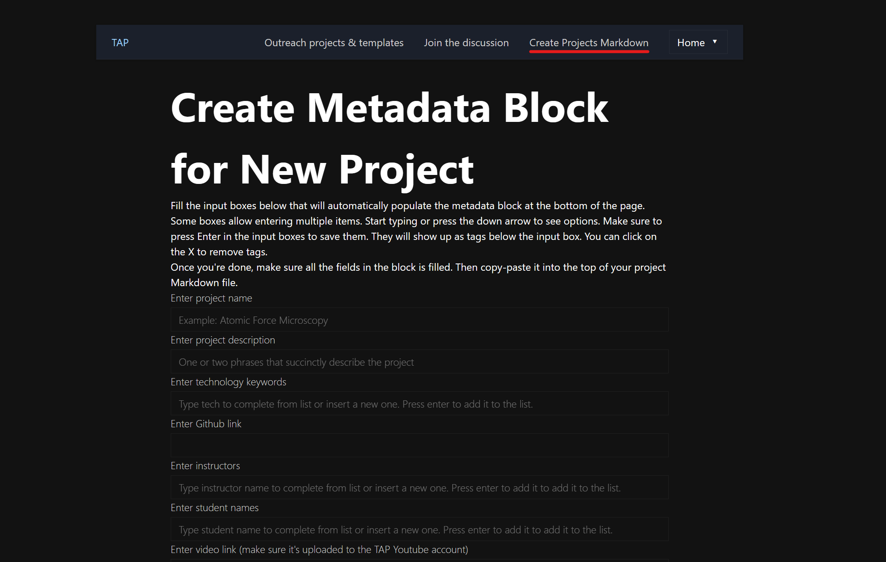
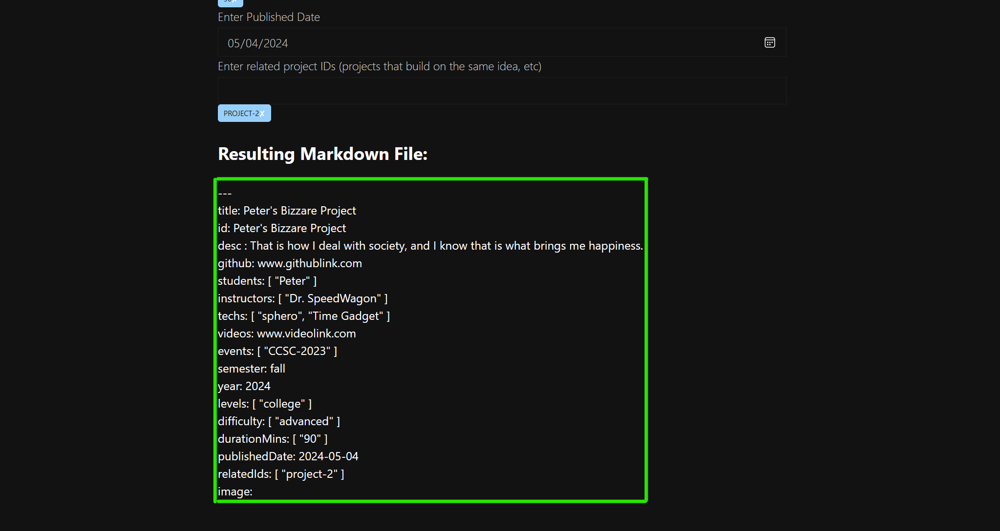
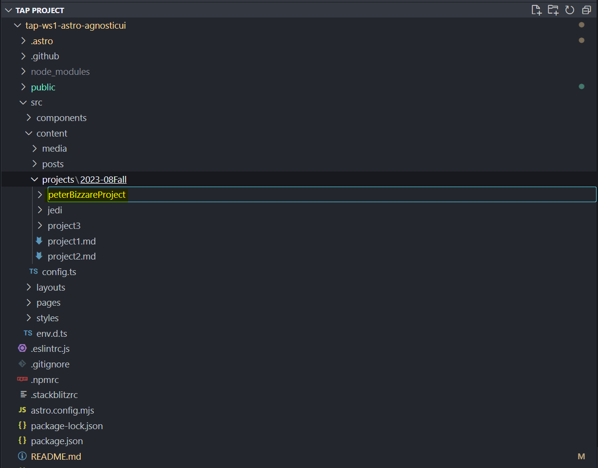

# TAP Projects and Blog Website with Astro, AgnosticUI, and Vue.js

Website for browsing TAP projects and blog posts. Built with static and dynamic components using the [Astro](https://astro.build/) framework. UI components from [AgnosticUI](https://agnosticui.com/) and dynamic [Vue 3](https://vuejs.org/) components.

Hosted at [tapggc.org](https://tapggc.org) using [Github Pages](https://pages.github.com), which is automatically deployed from this repository on each commit to `main` branch.

## How to Build and Deploy

All commands are run from the root of the project, from a terminal:

| Command           | Action                                       |
|:----------------  |:-------------------------------------------- |
| `npm install`     | Installs dependencies                        |
| `npm run dev`     | Starts local dev server at `localhost:3000`  |
| `npm run build`   | Build your production site to `./dist/`      |
| `npm run preview` | Preview your build locally, before deploying |

## How to Add a Blog Entry

Create a Markdown file under `/src/content/posts/`, under the appropriate semester directory. Check metadata of other posts to set field appropriately (TODO: specify details).

## 👀 How to Create a Project

Navigate to Create Projects Markdown

Complete the form and copy the markdown template below

Create a folder for desired project with respect to {year}-{month}{semester} (use camelCase)

Create a Markdown file within the folder (using camelCase)

[VERY IMPORTANT!] Every Project requires an image. Attach desired image within folder as well

Add the Image Path to the Image portion

All Setup! Now add as much information as you need
