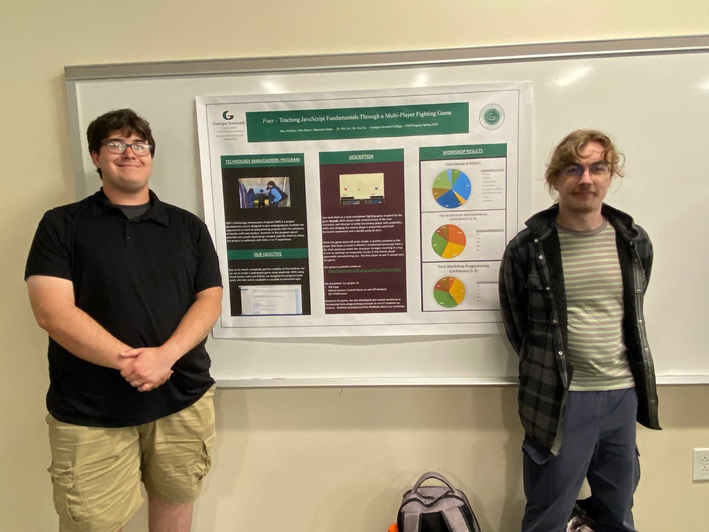
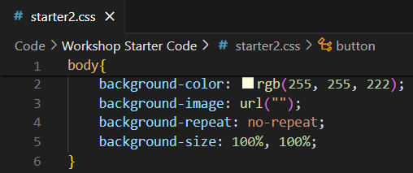
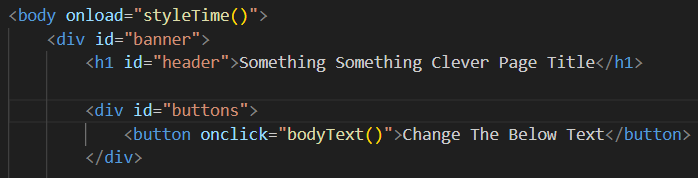
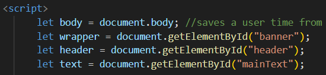
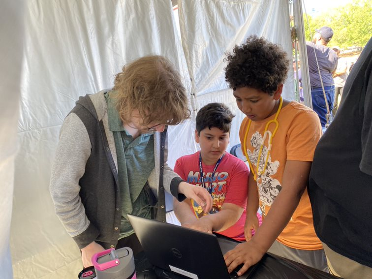
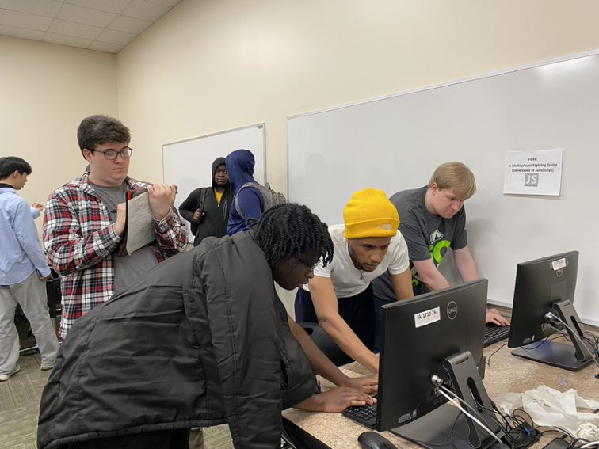
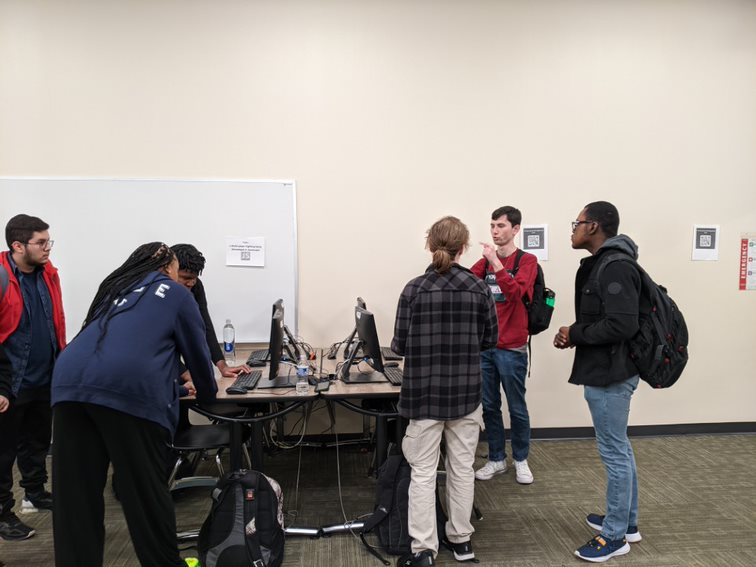
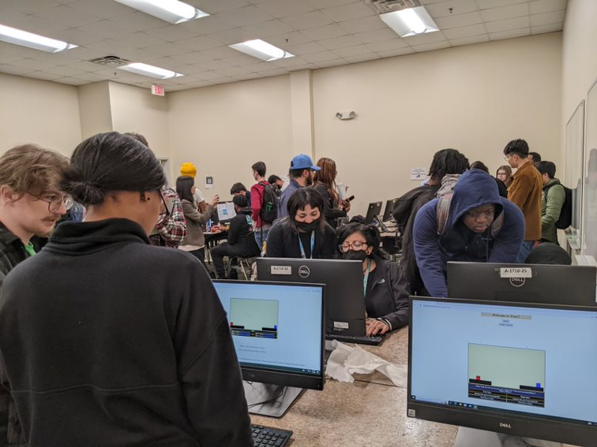

<!--Right text block, Project description -->

The goal of this project is to educate others about JavaScript basics while building a HTML/CSS webpage.

Foes is a web-hosted project. This project is curated to peak the interest of non-IT and beginning IT majors. By participating in the workshop, student will get to experiment with JavaScript, HTML, and CSS code to immediately view their changes on their browser.

 The Technology Ambassador Program at [GGC](http://www.ggc.edu/tap) strives to break the misconceptions of the IT field by providing fun workshops for students of all backgrounds. TAP students design engaging and fun outreach workshops to encourage interest in IT and STEM.

 <iframe width=560 ;height="100%" src="https://www.youtube.com/watch?v=TSae0OkMVps&ab_channel=TechnologyAmbassadorProgram" title="YouTube video player" frameborder="0" allow="accelerometer; autoplay; clipboard-write; encrypted-media; gyroscope; picture-in-picture; web-share" referrerpolicy="strict-origin-when-cross-origin" allowfullscreen style="width: 100%; height: 680px; margin-top: 2em;"></iframe>

 <!--content block, Activities, steps & materials -->

  ## Outreach Activities:

  1. Atlanta Science Festival, March 18, GGC - To promote IT field and the TAP program to college students and faculty
  2. TAP EXPO, March 21, GGC - To promote IT field and the TAP program to college students and faculty
  3. Atlanta Science Festival, March 25, Piedmont Park - To promote/introduce IT as a interest to K-12 children
  4. STARS, April 13, GGC - Presentation meant to peak interest in TAP and IT through the evaluation of survey results

  

  ## Play Foes: 
  1. Click the following link: ITEC 4450 - Alec Burns (aburns10.altervista.org)
  2. Then click the "Please Click Here To Play Foes" link displayed on the page
  3. This will take you to the main page of Foes and will allow you to keep
  playing.
  4. To play, grab a friend decides who will be Player 1 or Player 2.
  5. Player 1 will use keys ‘W’ , ‘A’ , and ‘D’ to move their player, and will use ‘V’ to shoot.
  6. Player 2 will use the arrow keys ‘UP’, ‘LEFT’ , and ‘RIGHT’ to move their player, and will use forward slash (‘/’) to shoot.
  7. To start the game, click the 'Start Game' button and use your keys to fight.
  8. When the end of the level is reached the game will pause and a message
  will appear at the bottom of the game screen.
  9. This will allow the "loser" of the current level to pick a powerup for the next round.
  10. After a power up is picked then the game will continue.
  11. Keep playing and repeat steps 8 and 9 until one player has won a total of five rounds.
  12. Once the game is over a small message at the bottom of the game screen will appear showing who won the game.
  13. To play again click the 'Reset Game' button at the top of the screen.
  14. To quit, close your browser.
  

<!-- Group Photo -->

   
   
   

  
  ##### From left to right: Alec Burns, Alex Shaklee
   

  
  ##### Visual Studio Code Logo
   
   
   

  
  ##### CSS Code Sample
   
   
   

  
  ##### HTML Code Sample
   
   
   

  
  ##### JavaScript Code Sample
   
   

<!--CONTENT BLOCK -->

## Project Setup:
- [Play game](https://github.com/TAP-GGC/Foe/blob/main/Documents/Installation%20Instructions/Play%20Foes.pdf)
- [Work Shop 1: Review basic concept of HTML, CSS and JavaScipt](https://github.com/TAP-GGC/Foe/blob/main/Documents/Workshop%20Instructions/CodePen%20Workshop%20Instructions/Foes-Workshop1.pdf)
- [Work shop 2: Focus on JavaScipt and how to create animation on 2D objects](https://github.com/TAP-GGC/Foe/blob/main/Documents/Workshop%20Instructions/CodePen%20Workshop%20Instructions/Foes-Workshop2.pdf)

 
 

  ## Photo Gallery

  
##### Atlanta Science Festival
   
   

  
  ##### Tap Expo 1
   
   
   

  
  ##### Tap Expo 2
   
   
   

  
  ##### Tap Expo 3
   
   
   

