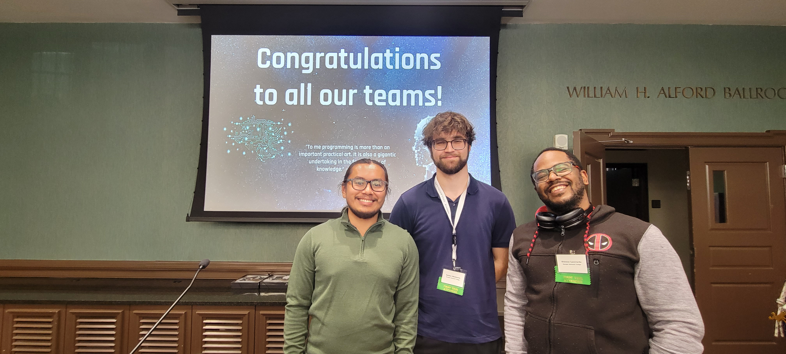
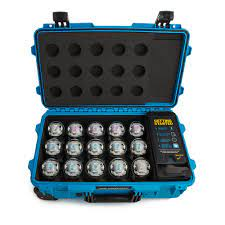

## Description:
**The primary goal of this project is educating others about algorithms by programming a robot through a maze using SpheroEDU. Sphero is a small robot ball that moves around by either remote control or code you feed it. This workshop is geared towards educating and creating interest in the IT field for non STEM majors. By engaging in our workshops, students will get to experiment with Sphero.edu and block coding, which allows them to learn about algorithms through relatable examples. The Technology Ambassador Program (TAP) at GGC strives to break the misconceptions of the IT field by providing fun workshops for students of all backgrounds. TAP students design engaging and fun outreach workshops to encourage interest in IT and STEM.**

## The Creators:

##### Ammar Mehicevic, Etienne Laccruche, Tony Lam

## Short Demo:

**Here is a 5 minute video walkthrough of our workshop that anyone with a sphero can do**

<iframe width="560" height="100%" src="https://www.youtube.com/embed/W7AJaQqIAE0?si=D3_BeB6ZyTDeGda7" title="YouTube video player" frameborder="0" allow="accelerometer; autoplay; clipboard-write; encrypted-media; gyroscope; picture-in-picture; web-share" referrerpolicy="strict-origin-when-cross-origin" allowfullscreen style="width: 560px; height: 315px;"></iframe>

## Project Setup/Installation:
- [Installing Sphero Edu](https://github.com/TAP-GGC/Jedi/blob/main/Media/Installing%20Sphero%20Edu.pdf)
- [Creating a Teacher Sphero Account](https://github.com/TAP-GGC/Jedi/blob/main/Media/Creating%20a%20Teacher%20Sphero%20Account.pdf)
- [Creating a Classroom and Adding Students in Sphero Edu](https://github.com/TAP-GGC/Jedi/blob/main/Media/CreatingaClassroomandAddingStudentsinSpheroEdu.pdf)
- [Creating a Program in Sphero Edu](https://github.com/TAP-GGC/Jedi/blob/main/Media/CreatingAProgramInSpheroEdu.pdf)
- [Construction](https://github.com/TAP-GGC/Jedi/blob/main/Documents/Construction.pdf)

## Materials List:

| Amount |&nbsp;&nbsp;&nbsp;&nbsp;&nbsp;&nbsp;&nbsp;&nbsp;&nbsp;&nbsp;&nbsp;&nbsp;&nbsp;&nbsp;&nbsp;&nbsp;&nbsp;&nbsp;&nbsp;&nbsp; Materials | Dimension |
|    :----:   |    :----:   |    :----:   |
| 6 | Foam Boards | 36 in. x 48 in. |
| 2 | Plywood | 36 in. x 48 in. |
| 1 | Hot Glue Gun | ----- |
| 1 | 30 Count Pack of Hot Glue Sticks | ----- |
| 1 | Exacto Knife | ----- |
| 1 | Chisel | ----- |
| 1 | Rubber Mallet | ----- |
| 2 | 6 Count Packs of Exacto Knife Blades | ----- |
| 15 | Sphero Bolt Robots | ----- |
| 15 | Sphero Protractors | ------ |
| ------ | Sphero EDU Desktop Application | ----- |

 

 

## Sphero EDU Easy Portion
  
`on start program` 
`roll 0° at 75 speed for 2.1s` 
`delay for 1.5s` 
`roll 90° at 75 speed for 1.6s` 
`delay for 1.5s` 
## Sphero EDU Hard Portion

 

 
`on start program` 
`roll 0° at 75 speed for 1.5s` 
`delay for 1.5s` 
`roll 90° at 75 speed for 0.5s` 
`delay for 1.5s` 
`roll 180° at 75 speed for 1.5s` 
`delay for 1.5s` 
`roll 90° at 75 speed for 0.7s` 
`delay for 1.5s` 
`roll 0° at 75 speed for 0.7s` 
`delay for 1.5s` 
`roll 90° at 75 speed for 0.5s` 
`delay for 1.5s` 
`roll 0° at 75 speed for 0.6s` 
`delay for 1.5s` 
`roll 270° at 75 speed for 0.6s` 
`delay for 1.5s` 
`roll 0° at 75 speed for 0.5s` 
`delay for 1.5s` 
`roll 90° at 75 speed for 0.6s` 
`delay for 1.5s` 
`roll 0° at 75 speed for 0.6s` 
`delay for 1.5s` 

 

See more in the [Source Code](https://github.com/TAP-GGC/Jedi).
