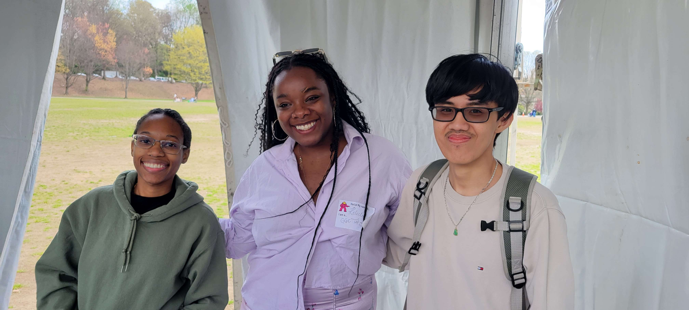
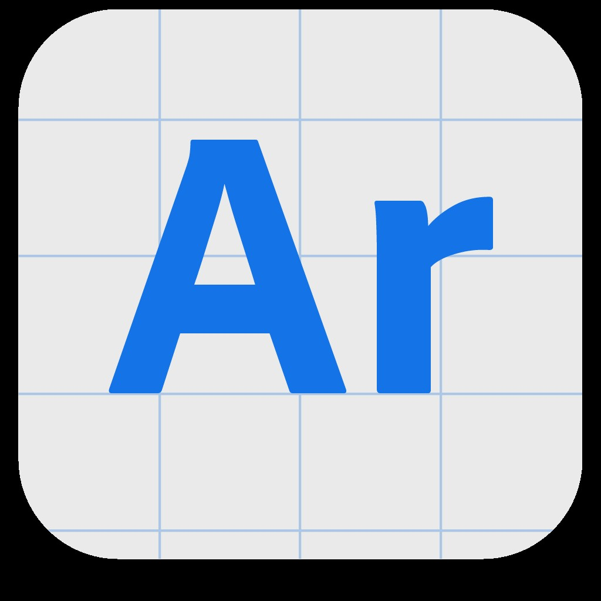
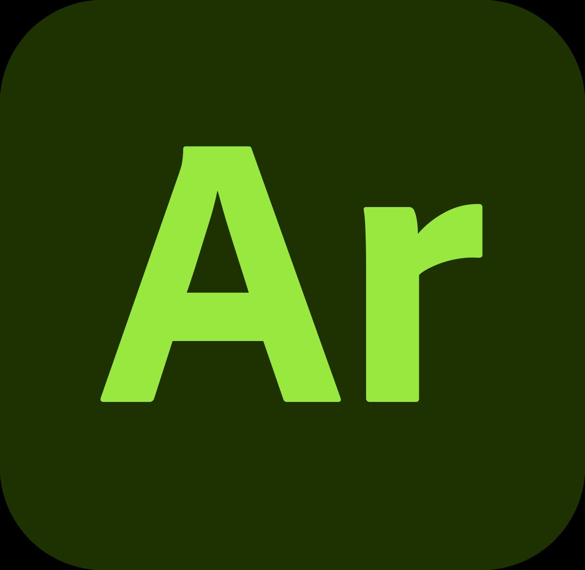

<!--Right text block, Project description -->	

The primary goal of this project is educating others about Augmented Reality (AR) using Adobe Aero and 3D Modeling using Blender.

This project showcases how to build a 3D snowmen in Blender, and then how to import it in Abobe Aero environment. The project is geared towards educating and creating interest in the IT field for non STEM majors. By engaging in our workshop, students will get to experiment with Blender, 3D modeling and AR, which allows them to learn about how to play with AR technology.

The Technology Ambassador Program at [GGC](http://www.ggc.edu/tap) strives to break the misconceptions of the IT field by providing fun workshops for students of all backgrounds. TAP students design engaging and fun outreach workshops to encourage interest in IT and STEM.

<iframe width="560" height="100%" src="https://www.youtube.com/embed/AOuorBHAStU?si=KyfqmvnR7CZnEDrS" title="YouTube video player" frameborder="0" allow="accelerometer; autoplay; clipboard-write; encrypted-media; gyroscope; picture-in-picture; web-share" referrerpolicy="strict-origin-when-cross-origin" allowfullscreen style="width: 100%; height: 680px; margin-top: 2em;"></iframe>

<!--content block, Activities, steps & materials -->

## Outreach Activities: <!--TODO: Fix layout**-->

1. Tap Expo, 2024, Georgia Gwinnett College
2. [Atlanta Science Festivals](https://atlantasciencefestival.org/),2024, Piedmont Park
3. Class Workshops – 2024, Georgia Gwinnett College

<!-- div ; style='float: left; margin-right: 15px; vertical-align: bottom; display: inline-block;font-size: 1.125em;'-->

## Steps:
<b> STEP 1: BLENDER & AERO </b>

1. Download [Blender](https://www.blender.org/download/) and [Aero](https://helpx.adobe.com/aero/get-started.html)
2. Open the blender app, click General to begin modelling
3. Click the cube already present on the canvas and press the delete/backspace key

 
<b> STEP 2: ADD MESH - ICO SPHERE </b>

1. Press Shift + A to open the Add menu.
2. Select Mesh > Icosphere. This will add a regular-sized icosphere to your scene.

 
<b> STEP 3: DUPLICATE ICO SPHERE (2x) </b>

1. Select the icosphere you just added by left-clicking on it.
2. Press Shift + D to duplicate it.
3. Press S to scale it smaller.
4. Press G then Z to move it along the Z-axis.
5. Scroll your mouse up to move it higher above the first icosphere.

 
<b> STEP 4: EYES OF THE BEHOLDER </b>

1. Add another icosphere by pressing Shift + A and selecting Mesh > Icosphere.
2. Scale this icosphere as small as you’d like the snowman’s eyes to be:
3. Press S to scale, then press Y to scale along the Y-axis to make the eyes look like ovals.
4. Press X to scale along the X-axis to flatten the ovals.
5. Shift D to duplicate it.
6. Press G, then X to move the duplicate eye beside the first.

 
<b> STEP 5: BUTTONS BUTTONS BUTTONS </b>

1. Add another icosphere by pressing Shift + A and selecting Mesh > Icosphere.
2. Scale this icosphere as small as you’d like the snowman’s buttons to be:
3. Press S to scale and drag to desired size
4. Press X to scale along the X-axis to flatten the ovals.
5. Press G, then Z to place along the z -axis.
6. Shift D to duplicate it.
7. Repeat steps until you’re satisfied with the number of buttons

 
<b> STEP 6: A CONE FOR A NOSE </b>

1. Add a cone by pressing Shift + A and selecting Mesh > Cone.
2. Rotate the cone on the Y-axis by pressing R then Y and typing 90.
3. Place the cone on the snowman's face as the nose.

### CONGRATULATIONS! 
### YOU BUILT A SNOMAN!

<!--div ; style='float: right; margin-right: 15px; vertical-align: bottom; display: inline-block; font-size: 1.25em;'-->

## Materials List:

| Amount |&nbsp;&nbsp;&nbsp;&nbsp;&nbsp;&nbsp;&nbsp;&nbsp;&nbsp;&nbsp;&nbsp;&nbsp;&nbsp;&nbsp;&nbsp;&nbsp;&nbsp;&nbsp;&nbsp;&nbsp; Materials | Dimension |
|    :----:   |    :----:   |    :----:   |
| 24 | Desktops (with Aero desktop & blender downloaded) | n/a |
| 24 | Mobile Devices - cellphones or Tablets (with Aero mobile downloaded) | n/a |

<!--TODO: Photo Gallery -->

 
 
 

##### From left to right: Carina George,  Kelechi Ariwodo and Thien Nghi Duong, 
 

 
 

 
 
 

<!--CONTENT BLOCK -->

## Project Setup & Installation:
- [Download Blender & Aero(Desktop & Mobile) - PDF](https://github.com/TAP-GGC/QuantumQuirks/blob/main/Documents/How%20download%20Blender%20and%20Aero.pdf)
- [Download Blender & Aero(Desktop & Mobile) - Video](https://youtu.be/mwFiZGFVci4?si=KqiPkp87MJ0s3GKK)
- [Building a Snowman in Blender](https://youtu.be/NL7IVITbNt0?si=NV3Kq1guVl0LHK-f)
- [Augmented Reality Integration with Adobe Aero](https://github.com/TAP-GGC/Jedi/blob/main/Media/CreatingaClassroomandAddingStudentsinSpheroEdu.pdf)
- 
 
 

<!--[jediPhoto](./JediImage.jpg)-->
##### S3 Workshop 

 
 

 
 
 

<!--div style='text-align:center; display: inline-block; font-size: 1.25em'>

## Sphero EDU Easy Portion
<style='text-align:center; display: inline-block; font-size: 1.25em'>

  
`on start program` 
`roll 0° at 75 speed for 2.1s` 
`delay for 1.5s` 
`roll 90° at 75 speed for 1.6s` 
`delay for 1.5s` 

## Sphero EDU Hard Portion

 

 
`on start program` 
`roll 0° at 75 speed for 1.5s` 
`delay for 1.5s` 
`roll 90° at 75 speed for 0.5s` 
`delay for 1.5s` 
`roll 180° at 75 speed for 1.5s` 
`delay for 1.5s` 
`roll 90° at 75 speed for 0.7s` 
`delay for 1.5s` 
`roll 0° at 75 speed for 0.7s` 
`delay for 1.5s` 
`roll 90° at 75 speed for 0.5s` 
`delay for 1.5s` 
`roll 0° at 75 speed for 0.6s` 
`delay for 1.5s` 
`roll 270° at 75 speed for 0.6s` 
`delay for 1.5s` 
`roll 0° at 75 speed for 0.5s` 
`delay for 1.5s` 
`roll 90° at 75 speed for 0.6s` 
`delay for 1.5s` 
`roll 0° at 75 speed for 0.6s` 
`delay for 1.5s` 

 
</div-->

 
 
 

